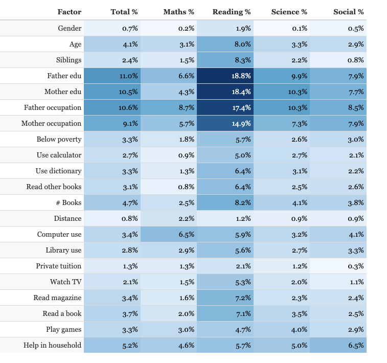

## Segmented Univariate Analysis

- Segmented univariate analysis allows you to compare subsets of data, which is a powerful technique because it helps you understand how a relevant metric varies across different segments
- Basis of segmentation : Any categorical variable available in the dataset

### Ex:
- On average, a higher number of articles are shared on weekdays than weekends
- Among the weekdays, articles published on Wednesdays get shared more than on any other weekday

The entire segmentation process can be divided into four parts:
1. Take raw data
2. Group by dimensions
3. Summarise using a relevant metric such as mean, median, etc.
4. Compare the aggregated metric across groups/categories

### Correlation vs Causation:

### Quick way of Segmented Univariate analysis:
- Group by every possible Cat column and observe their impact across the other variables
- https://gramener.com/nas/ 

 
	

#### Comparison of Averages:

#### Comparison of Other metrics:

