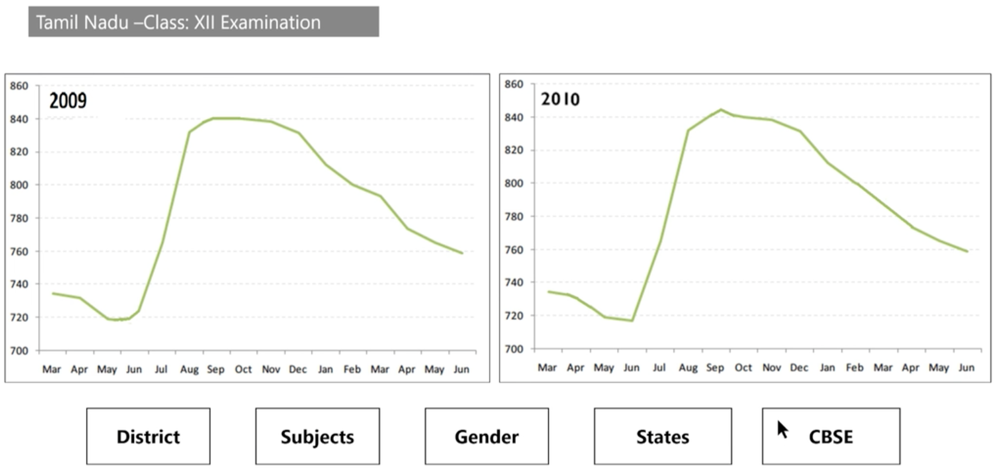

## Derived Metrics

### Ex: Days of the week, year etc

 
	

### Types:
- Type driven
  - Categorical/Nominal variable
    - differ only by their names; there is no order among categories
    - Color
  - Ordinal variable
    - follow a certain order, but the mathematical difference between categories is not meaningful, 
    - Education level
  - Interval variable
    - mathematical difference between categories is meaningful but division or multiplication is not
    - Temperature: the difference between 40 and 30 degrees C is meaningful, but 30 degrees x 40 degrees is not)
  - Ratio variable
    - Ratio variables are nominal, ordinal and interval type
    - Sales
  - Web URL, Names, Emails, Image URL
  - For quantitative variables, use binning and convert them to categorical - derived
- Business driven
  - Students marks -> pass/fail
  - Banking -> # transactions in a month, default balance
- Data driven
  - BMI from height and weight
