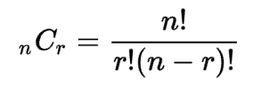
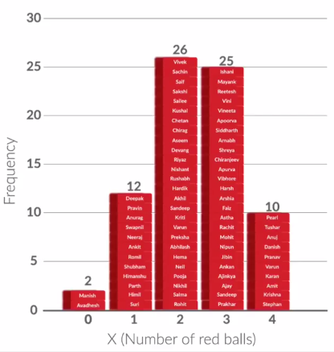

## Inferential Statistics

- In certain situations, you are forced to work with a smaller sample of the data, instead of having the entire data to work with.
- Situations like these arise all the time at big companies like Amazon. 
- For example, say the Amazon QC department wants to know what proportion of the products in its warehouses are defective. 
- Instead of going through all of its products (which would be a lot!), the Amazon QC team can just check a small sample of 1,000 products and then find, for this sample, the defect rate (i.e. the proportion of defective products). 
- Then, based on this sample's defect rate, the team can "infer" what the defect rate is for all the products in the warehouses.
- This process of “inferring” insights from sample data is called “Inferential Statistics”.

### Combinations:

 
	

    

### Probability:
#### Addition Rule 1:
- When two events, A and B, are mutually exclusive, the probability that A or B will occur is the sum of the probability of each event.
  - P(A or B) = P(A) + P(B)
#### Addition Rule 2:
- When two events, A and B, are non-mutually exclusive, the probability that A or B will occur is:
    P(A or B) = P(A) + P(B) - P(A and B)
- Ex: 
In a math class of 30 students, 17 are boys and 13 are girls. On a unit test, 4 boys and 5 girls made an A grade. If a student is chosen at random from the class, what is the probability of choosing a girl or an A student?
Probabilities: P(girl or A) = P(girl) + P(A) - P(girl and A)
    = 	13	 + 	 9 	 - 	 5 
    30		30		30
                    
    = 	17				
    30				
#### Multiplication Rule 1:
- When two events, A and B, are independent, the probability of both occurring is:
P(A and B) = P(A) · P(B)

### Random Variable

- the random variable X basically converts outcomes of experiments to something measurable
- Ex: Yes/No to 1/0
- Ex: # of red balls to X

#### Probability Distribution:
- a probability distribution is ANY form of representation that tells us the probability for all possible values of X

##### For the histogram:

 
	

                
        
##### As table

 
	

        
        
        
##### As chart

 
	

        
        
##### As equation
P(x) = x/21
(for x = 1, 2, 3, 4, 5 and 6)
    

- the probability distribution and frequency distribution would be exactly similar in shape, just with different scales
- in a valid, complete probability distribution, there are no negative values, and the total of all probability values adds up to 1.
- Ex: Quantity the following problem by using Random variable X

|Economic Cycle|Probability|
|Recession|0.1|
|Normal|0.7|
|Boom|0.2|

- let’s define X as X = Net revenue of the project.
|X (Net Revenue of Project, in ₹ crores)|P(x)|
|305|0.1|
|+15|0.7|
|+95|0.2|
    

### Expected Value

- expected value for a variable X is the value of X we would “expect” to get after performing the experiment once. 
- It is also called the expectation, average, and mean value

- for a random variable X that can take values x1,x2,x3,...........,xn, the expected value (EV) is given by:

 
	

 
    

    
