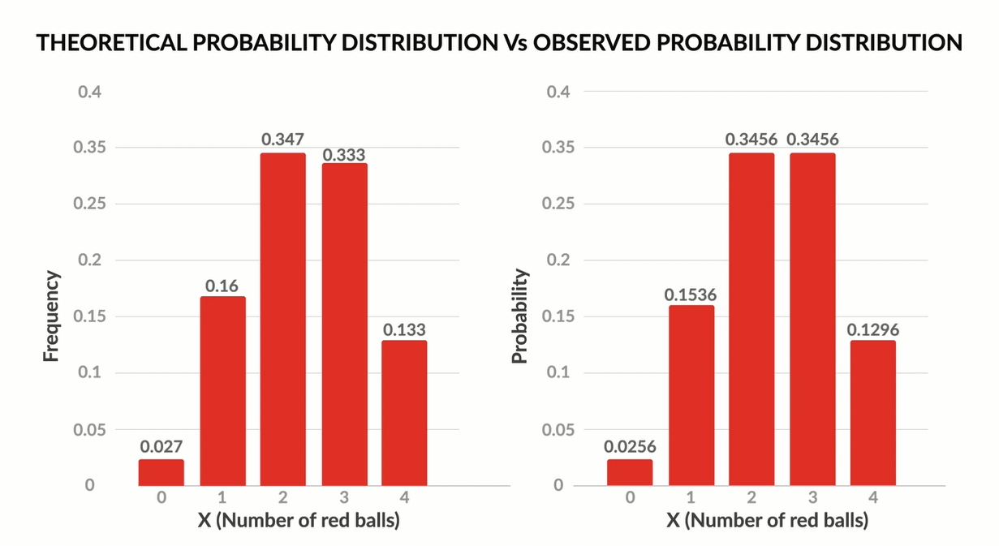
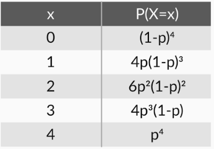
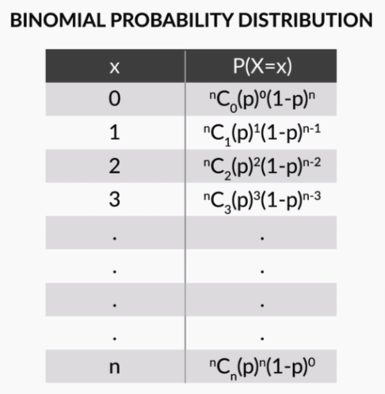
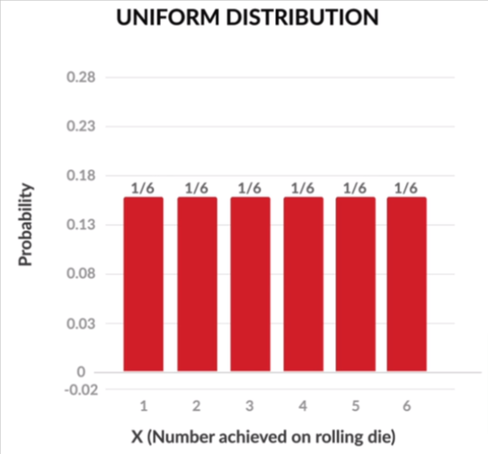
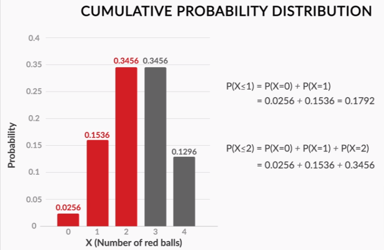
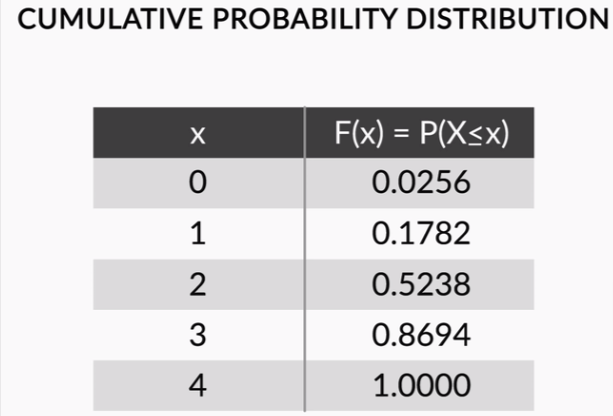

## Discrete Probability Distribution

### Probability Without Experiment :

- Conduction an experiment is a lengthy process. Is there a shorter process for finding the probabilities, perhaps one that doesn’t need repeated experiments
- Ex:
  - the bag contains 2 blue and 3 red balls.
  - What is the probability that you would get this combination of balls after 4 trials?
  - Answer: 0.4*0.6*0.6*0.6

  - What is the probability that you will get 3 red balls after 4 trials? 
  - 4*(0.4*0.6*0.6*0.6)
    - there are four combinations in which you could get three red balls. All these four combinations have the same probability, i.e. 0.4*0.6*0.6*0.6. So, the total probability of getting 3 red balls is 4*(0.4*0.6*0.6*0.6).

  - Similarly, for X=0,2,4
  - Answer: P(X=0) + P(X=2) + P(X=4)
  - Calculate P(X) as above

- theoretical (calculated) values of probability are actually quite close to the experimental values that we got. The small differences that you can notice exist because of the low number of experiments done.

 
	

                

### Binomial Distribution

#### Generalizing Probability:

 
	

                

- Extending the above probabilities for generic value of X=r,
- The formula for finding  binomial probability is given by:
  - P(X=r)= nCr(p)r(1−p)n−r
  - Where n is no. of trials, p is probability of success and r is no. of successes after n trials.

 
	

                

- Conditions:
  1. Total number of trials is fixed at n
  2. Each trial is binary, i.e., has only two possible outcomes - success or failure
  3. Probability of success is same in all trials, denoted by p

#### Uniform Distribution

 
	

                

Ref:
1. Poisson Distribution
2. Geometric Distribution
3. Negative Binomial Distribution

### Cumulative Probability

 
	

                

 
	

                

    - the cumulative probability of X, denoted by F(x), is defined as the probability of the variable being less than or equal to x.
        ○ F(x) = P(X<x)
        ○ For example, F(4) = P(X<4), F(3) = P(X<3).
