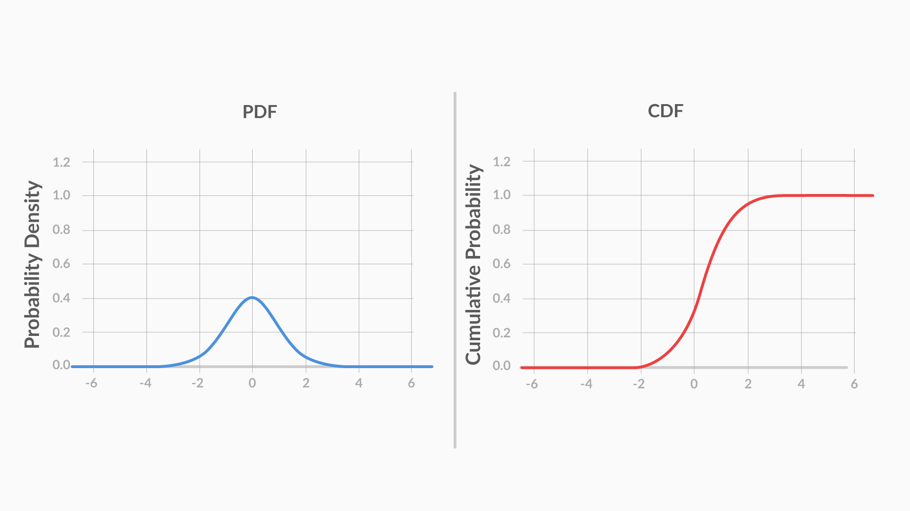
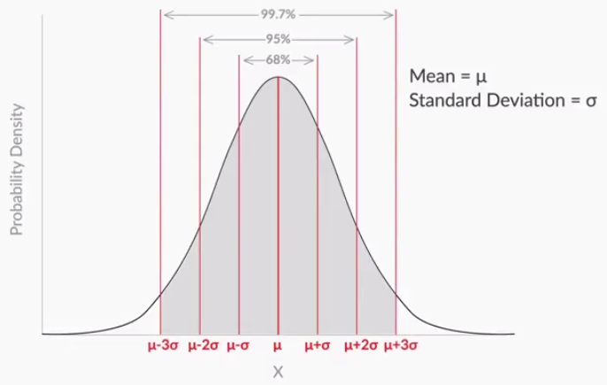
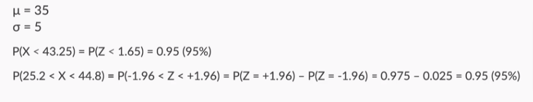

## Continuous Probability Distribution

- for a continuous random variable, the probability of getting an exact value is very low, almost zero. 
- Hence, when talking about the probability of continuous random variables, you can only talk in terms of intervals

### CDF:
- a CDF, or a cumulative distribution function, is a distribution which plots the cumulative probability of X against X.

 
	

                
            
### PDF:
• A PDF, or Probability Density Function, however, is a function in which the area under the curve, gives you the cumulative probability.

 
	

        

- The main difference between the cumulative probability distribution of a continuous random variable and a discrete one, is the way you plot them. 
- While the continuous variables’ cumulative distribution is a curve, the distribution for discrete variables looks more like a bar chart:

- PDFs are more commonly used in real life. The reason is that it is much easier to see patterns in PDFs as compared to CDFs
- Ex:

 
	

        

### Normal Distribution 
#### Normal Distribution / Bell curve / Gaussian Distribution:
- Symmetric distribution, where you expect most values lie close to the centre
- Mean = Median = Mode
- Symmetric about the mean
    
All data that is normally distributed follows the 1-2-3 rule. This rule states that there is a -
1. 68% probability of the variable lying within 1 standard deviation of the mean
2. 95% probability of the variable lying within 2 standard deviations of the mean
3. 99.7% probability of the variable lying within 3 standard deviations of the mean

 
	

    
#### Standard Normal Distribution:
- to find the probability, you do not need to know the value of the mean or the standard deviation — it is enough to know the number of standard deviations away from the mean your random variable is. 
- the standardised random variable is an important parameter. It is given by:

 
	

                

- Basically, it tells you how many standard deviations away from the mean your random variable is
- you can find the cumulative probability corresponding to a given value of Z, using the Z table:
- A positive value means it to the right of the mean and high cumulative probability and vice versa for a negative value

- Ex:

 
	

    

##### Z-score vs 1-2-3 rule:

 
	

More:
    1. Exponential Distribution
    2. Gamma Distribution
    3. Chi-Squared Distribution

